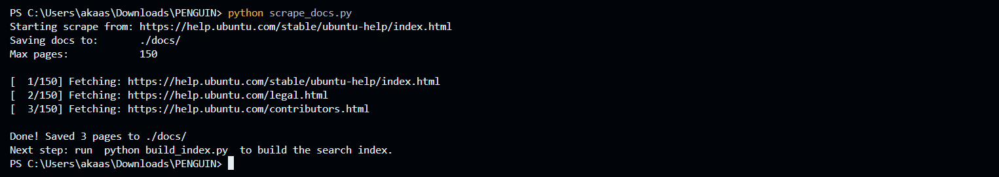
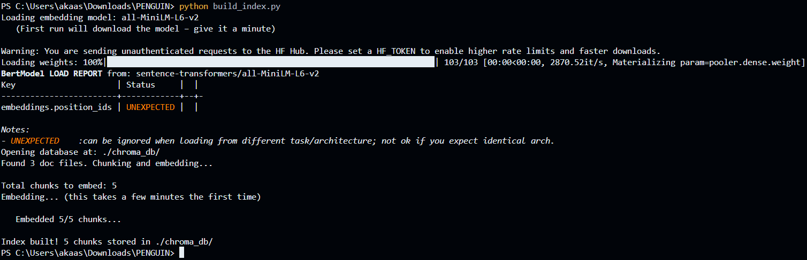
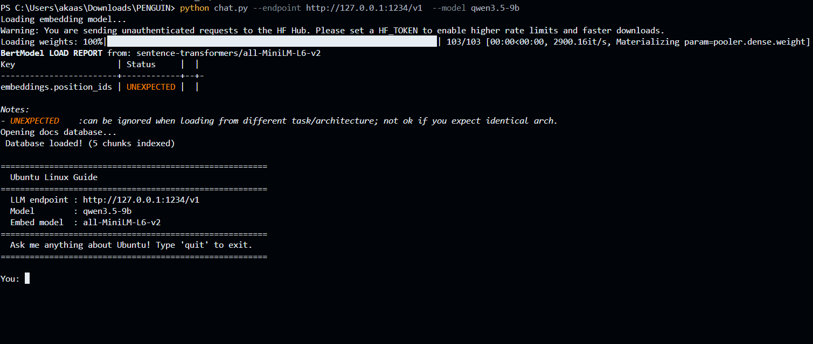
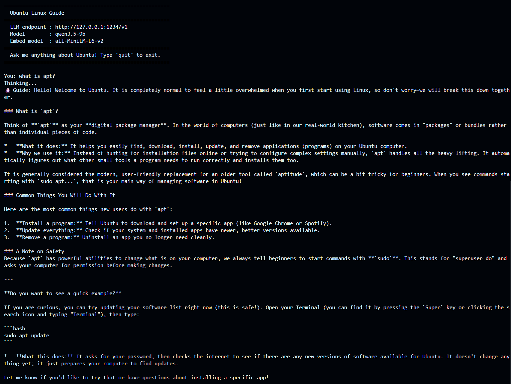

# Ubuntu Linux Guide

A beginner-friendly CLI chatbot that answers questions about Ubuntu using 
**real Ubuntu documentation** and a **local LLM** you're already running.

No internet connection needed at chat time. No OpenAI API key. 
Fully private and runs on your machine.

---

## How it works

```
Ubuntu docs website
       ↓
./docs/ folder
       ↓
./chroma_db/ (local vector database)
       ↓  
Your terminal  ← you chat here!
```

---

## Setup

### 1. Install Python dependencies

```bash
pip install -r requirements.txt
```

### 2. Download the Ubuntu docs

This crawls the Ubuntu help website and saves ~150 pages as text files.

```bash
python scrape_docs.py
```

Takes about 2–3 minutes. Creates a `./docs/` folder with `.txt` files.

### 3. Build the search index

This reads all the text files, creates embeddings, and stores them locally.

```bash
python build_index.py
```

First run downloads the embedding model (~90 MB). 
Building the index takes a few minutes.

### 4. Start chatting!

Make sure your local LLM server is running (Ollama, LM Studio, etc.), then:

```bash
# Default – expects Ollama on localhost:11434 with llama3
python chat.py

# Custom endpoint and model
python chat.py --endpoint http://localhost:11434/v1 --model llama3
python chat.py --endpoint http://localhost:1234/v1  --model mistral-7b
```

---

## Command line options

### `scrape_docs.py`
No arguments needed. Just run it.

### `build_index.py`

| Flag | Default | Description |
|------|---------|-------------|
| `--model` | `all-MiniLM-L6-v2` | HuggingFace embedding model to use |

### `chat.py`

| Flag | Default | Description |
|------|---------|-------------|
| `--endpoint` | `http://localhost:11434/v1` | Your local LLM's API URL |
| `--model` | `llama3` | Model name to use for chat |
| `--embed-model` | `all-MiniLM-L6-v2` | HuggingFace embedding model |

---

## Works with any local LLM

| Tool | Default URL |
|------|-------------|
| [Ollama](https://ollama.ai) | `http://localhost:11434/v1` |
| [LM Studio](https://lmstudio.ai) | `http://localhost:1234/v1` |
| Any OpenAI-compatible server | just pass your URL |

---

## Project structure

```
ubuntu-guide/
├── scrape_docs.py   # Step 1 – downloads docs from Ubuntu's website
├── build_index.py   # Step 2 – builds the local vector search index  
├── chat.py          # Step 3 – the actual chatbot CLI
├── requirements.txt # Python dependencies
├── docs/            # Created by scrape_docs.py
└── chroma_db/       # Created by build_index.py
```

---

## Re-indexing / updating docs

Just run both steps again – the index will be rebuilt fresh:

```bash
python scrape_docs.py
python build_index.py
```

---

## Example




